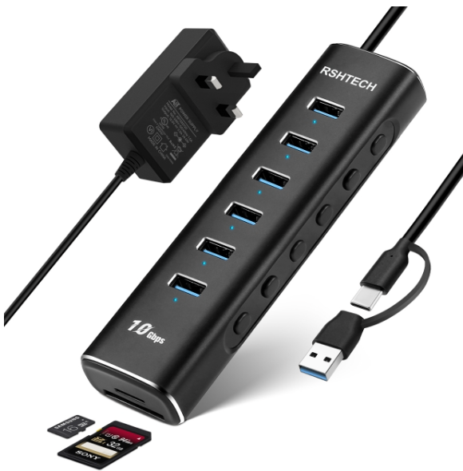
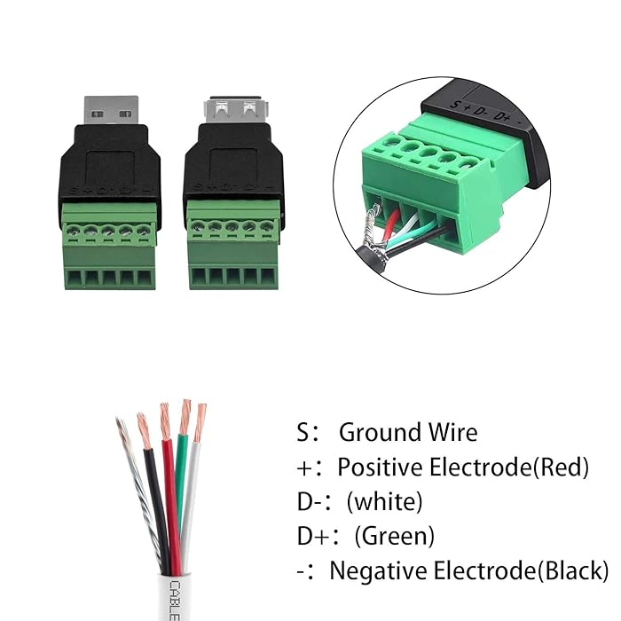
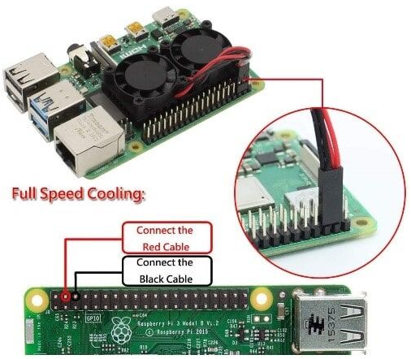

## Powered USB Hub
I have [overclocked](https://github.com/defencedog/radxazero3E/tree/main/dtb_dtbo/overclocked) my SBC I want to power everything externally even cooling fans & BT dongles, thus, I am using [RSHTECH hub](https://www.rshtech.com/products/8-port-powered-usb-c-usb-31-32-gen2-hub-aluminum-usb-splitter-with-6-usb-a-data-ports-sd-tf-card-readers-rsh-a107d) to 
1. power my 3E (you can use GPIO terminals or type-C port)
2. power my twin fan using hub NOT GPIO terminals (details below)
3. attaching multiple hardisks
4. attaching external sdcard for extracting / organising camera pictures
5. & BT / WIFI dongle to it; I dont use WIFI however



## Cooling Radxa
These twin fans for Raspberry Pi fits neatly on 3E. I bought _USB terminal connector block_ & instead of directly powering fan via GPIO terminal I powered it using +ive / GND of _USB connector terminals_ & then insert into USB hub




## BT Dongle
### Enable Bluetooth support 
Under Armbian `sudo armbian-config` -> Network -> Install BT support It will start installing required packages
### Compiling drivers
Before compiling any drivers always make sure if its availble by default. Use `hciconfig` & `bluetoothctl` commands to know if BT device is active.

Make sure `rfkill` is not bloccking any bluetooth devices otherwise `sudo rfkill unblock bluetooth` The output must be like
```
ukhan@radxa-zero3:~$ rfkill
ID TYPE      DEVICE          SOFT      HARD
 0 bluetooth bt_default unblocked unblocked
 1 bluetooth hci0       unblocked unblocked
 2 wlan      phy0       unblocked unblocked
```
I am using dongle 4.xx BT [that is on the left](https://github.com/defencedog/orangepi3b_v2.1/blob/main/peripherals/README.md). My repo also has the `.tar.gz` for it module making. Use method named _Preferred for left device_

## Terminal Music Player
### Install audio stuff
```
sudo apt install pulseaudio-module-bluetooth pulseaudio-utils cmus
sudo killall pulseaudio
pulseaudio --start    
sudo systemctl restart bluetooth
systemctl status bluetooth #check for any error
```
### Connecting & pairing JBL audio BT speakers
```
bluetoothctl # should display Controller 90:DE:80:EA:18:D6 
discoverable on
scan on # should display speakers 12 digit address code; mine is 41:42:FE:6C:31:51
pair 41:42:FE:6C:31:51
trust 41:42:FE:6C:31:51
connect 41:42:FE:6C:31:51
```

If BT & audio utilities work you will see following proper output, there is * at _index 1_ My device are speakers MT
```
ukhan@radxa-zero3:~$ pacmd list-sinks 
2 sink(s) available.
    index: 0
	name: <alsa_output.platform-hdmi-sound.stereo-fallback>
	driver: <module-alsa-card.c>
	flags: HARDWARE DECIBEL_VOLUME LATENCY DYNAMIC_LATENCY
	state: SUSPENDED
	suspend cause: IDLE
	priority: 9000
	volume: front-left: 65536 / 100% / 0.00 dB,   front-right: 65536 / 100% / 0.00 dB
	        balance 0.00
	base volume: 65536 / 100% / 0.00 dB
	volume steps: 65537
	muted: no
	current latency: 0.00 ms
	max request: 0 KiB
	max rewind: 0 KiB
	monitor source: 0
	sample spec: s16le 2ch 44100Hz
	channel map: front-left,front-right
	             Stereo
	used by: 0
	linked by: 0
	configured latency: 0.00 ms; range is 0.50 .. 2000.00 ms
	card: 0 <alsa_card.platform-hdmi-sound>
	module: 7
	properties:
		alsa.resolution_bits = "16"
		device.api = "alsa"
		device.class = "sound"
		alsa.class = "generic"
		alsa.subclass = "generic-mix"
		alsa.name = "fe400000.i2s-i2s-hifi i2s-hifi-0"
		alsa.id = "fe400000.i2s-i2s-hifi i2s-hifi-0"
		alsa.subdevice = "0"
		alsa.subdevice_name = "subdevice #0"
		alsa.device = "0"
		alsa.card = "0"
		alsa.card_name = "rockchip-hdmi0"
		alsa.long_card_name = "rockchip-hdmi0"
		device.bus_path = "platform-hdmi-sound"
		sysfs.path = "/devices/platform/hdmi-sound/sound/card0"
		device.form_factor = "internal"
		device.string = "hw:0"
		device.buffering.buffer_size = "352800"
		device.buffering.fragment_size = "176400"
		device.access_mode = "mmap+timer"
		device.profile.name = "stereo-fallback"
		device.profile.description = "Stereo"
		device.description = "Built-in Audio Stereo"
		module-udev-detect.discovered = "1"
		device.icon_name = "audio-card"
	ports:
		analog-output: Analog Output (priority 9900, latency offset 0 usec, available: unknown)
			properties:
				
	active port: <analog-output>
  * index: 1
	name: <bluez_sink.41_42_FE_6C_31_51.a2dp_sink>
	driver: <module-bluez5-device.c>
	flags: HARDWARE HW_VOLUME_CTRL DECIBEL_VOLUME LATENCY 
	state: SUSPENDED
	suspend cause: IDLE
	priority: 9950
	volume: front-left: 61924 /  94% / -1.48 dB,   front-right: 61924 /  94% / -1.48 dB
	        balance 0.00
	base volume: 65536 / 100% / 0.00 dB
	volume steps: 128
	muted: no
	current latency: 0.00 ms
	max request: 3 KiB
	max rewind: 0 KiB
	monitor source: 1
	sample spec: s16le 2ch 44100Hz
	channel map: front-left,front-right
	             Stereo
	used by: 0
	linked by: 1
	fixed latency: 45.32 ms
	card: 1 <bluez_card.41_42_FE_6C_31_51>
	module: 22
	properties:
		bluetooth.protocol = "a2dp_sink"
		bluetooth.codec = "sbc"
		device.description = "MT"
		device.string = "41:42:FE:6C:31:51"
		device.api = "bluez"
		device.class = "sound"
		device.bus = "bluetooth"
		device.form_factor = "headphone"
		bluez.path = "/org/bluez/hci0/dev_41_42_FE_6C_31_51"
		bluez.class = "0x240418"
		bluez.alias = "MT"
		device.icon_name = "audio-headphones-bluetooth"
	ports:
		headphone-output: Headphone (priority 0, latency offset 0 usec, available: unknown)
			properties:
				
	active port: <headphone-output>
ukhan@radxa-zero3:~$ 

```
How to use `cmus` as audio player is [detailed here](https://linux.die.net/man/7/cmus-tutorial)
